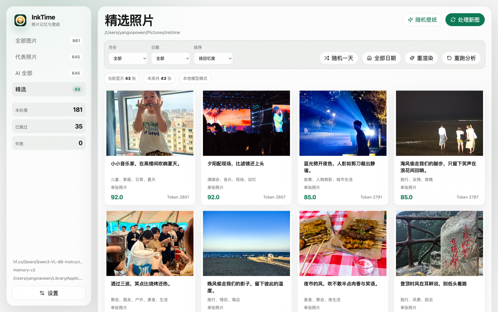
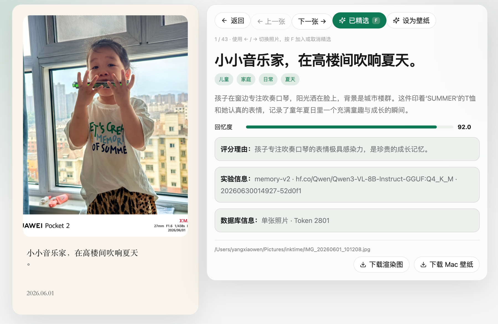
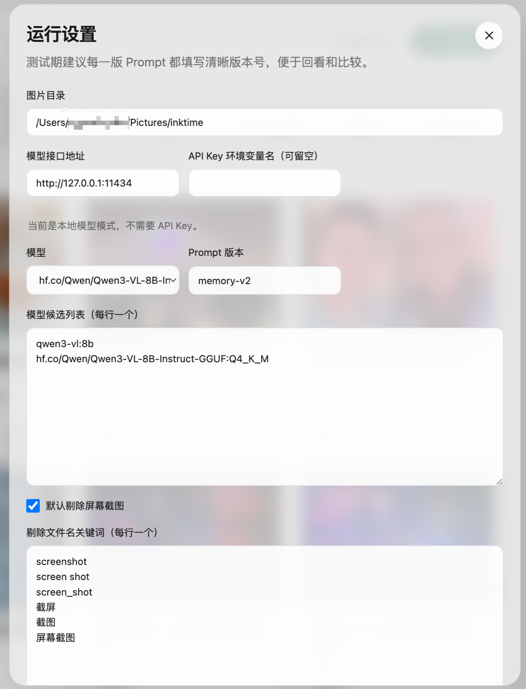
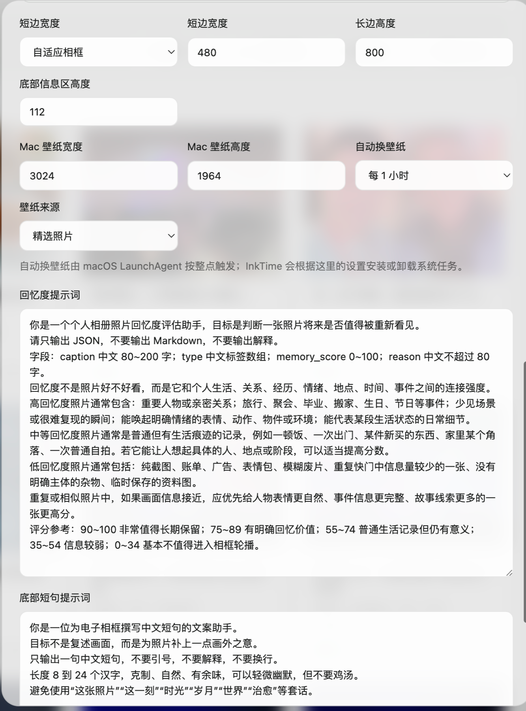
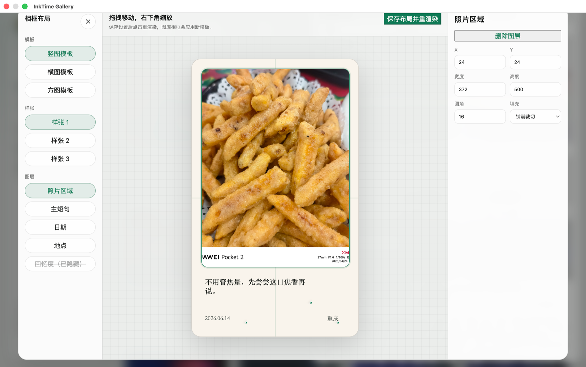
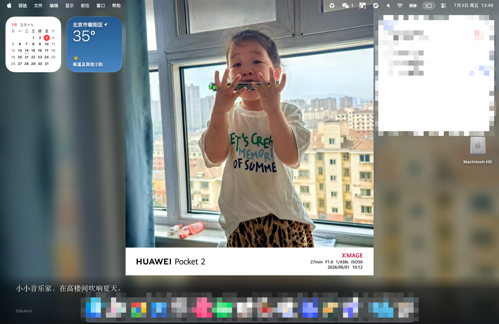

<div align="center">
  

  # InkTime Gallery

  [简体中文](README.md) | English

  Turn the local photos worth revisiting into a living memory gallery on your Mac.

  [](https://github.com/niiwei/inktime/actions/workflows/build.yml)
  [](LICENSE)
  [](#download)
  [](#local-models)
</div>



## Why InkTime

Photo libraries grow quietly. The moments you actually want to revisit get buried under screenshots, bursts, meals, receipts, and random saves. By the time you decide to organize them, it is hard to know where to start.

InkTime is a local-first macOS photo memory assistant. It scans a folder, lets a vision model find meaningful moments, writes restrained Chinese captions, renders frame cards, and rotates your desktop wallpaper on a whole-hour schedule.

It does not require a cloud album or a hosted backend. Your photos, SQLite database, rendered images, and wallpaper history stay on your Mac. If you use a local Ollama model, image understanding can stay fully local too.

## What It Does

| Capability | What you get |
| --- | --- |
| Memory gallery | Scan a full photo folder and clearly separate pending, processed, skipped, failed, and curated photos. |
| AI photo reading | Generate a Chinese title, tags, memory score, reason, and short bottom caption. |
| Fast curation | Browse with left/right arrows and press `F` to curate or uncurate. |
| Skip reasons | Screenshots, similar bursts, and low-value images show why they were skipped. |
| Frame rendering | Turn photos into frame-style images with title, date, and caption. |
| Layout editing | Drag, resize, and delete layers like a lightweight Figma canvas, then rerender in bulk. |
| Wallpaper rotation | Generate Mac wallpapers from curated or AI-processed photos and rotate them automatically. |
| Local models | Works with Ollama by default, with OpenAI-compatible providers available in config. |

## Product Tour

### Gallery And Detail

| Curated gallery | Photo detail |
| --- | --- |
|  |  |

### Settings And Prompts

| Model settings | Prompt settings |
| --- | --- |
|  |  |

### Frames And Wallpapers

| Frame layout editor | Mac wallpaper output |
| --- | --- |
|  |  |

## Download

The recommended user install is a GitHub Release asset:

- [Download InkTime.dmg](https://github.com/niiwei/inktime/releases/latest)

Current release notes:

- Mainly targets Apple Silicon Mac.
- The current build is unsigned, so the first launch may require approval in macOS security settings.
- Local-model usage requires [Ollama](https://ollama.com/) to be installed and running.

## Quick Start

For end users:

1. Download `InkTime.dmg` from [Releases](https://github.com/niiwei/inktime/releases).
2. Open the DMG and move `InkTime.app` into `Applications`.
3. Start Ollama and make sure your vision model is available.
4. Open InkTime, choose a photo folder, scan, then process selected photos.

For developers:

```bash
npm install
npm run electron:dev
```

## Local Models

The default config is designed for local Ollama:

```json
{
  "providerBaseUrl": "http://127.0.0.1:11434",
  "apiKeyEnvName": "",
  "model": "qwen3-vl:8b"
}
```

Model input images are resized to a longest edge of `1024px` before being sent to Ollama, and Ollama requests use `num_ctx=8192`.

For online providers, copy [.env.example](.env.example) and set the relevant API key locally. Do not commit `.env` or `.env.local`.

## How It Runs

InkTime is one app with two running modes:

| Mode | For | Meaning |
| --- | --- | --- |
| Development mode | Developers | Frontend, local API, and Electron shell run separately for debugging. |
| Packaged app | End users | Download `InkTime.app` or `InkTime.dmg` and launch it like a normal Mac app. |

Internal layers:

| Layer | Path | Role |
| --- | --- | --- |
| Desktop shell | `electron/` | Starts the macOS window, tray menu, runtime folders, and LaunchAgent management. |
| Local API | `server/` | Owns config, SQLite, scanning, model calls, rendering, and wallpaper side effects. |
| UI | `src/ui/` | React interface for gallery, processing, settings, curation, and layout editing. |
| Background script | `scripts/` | Independent wallpaper script used by macOS `launchd`. |
| Docs | `docs/` | Architecture, roadmap, visual notes, and upstream reading notes. |

Packaged app data is stored outside the repository:

```text
~/Library/Application Support/inktime-gallery/config/
~/Library/Application Support/inktime-gallery/data/
```

The repository does not include your personal photos, runtime SQLite database, generated renders, wallpapers, logs, or local environment files.

## Wallpaper Automation

Automatic wallpaper rotation is handled by macOS, not by an always-running app timer.

InkTime installs or updates this LaunchAgent:

```text
~/Library/LaunchAgents/com.inktime.gallery.wallpaper.plist
```

At the configured whole-hour schedule, macOS starts `scripts/set-random-wallpaper.js`. The script reads runtime config and SQLite directly, applies the wallpaper, verifies the actual macOS desktop path, and only then writes `wallpaper_history`.

Sleeping Macs do not run scheduled tasks while asleep; the next scheduled trigger happens after the machine is awake.

## Development

```bash
npm run dev            # Start browser-style development server
npm run electron:dev   # Start Electron development mode
npm run build          # Build frontend assets
npm run electron:pack  # Package a local macOS app
npm run electron:dist  # Build a distributable DMG
```

## Project Structure

```text
.
├── electron/              # Electron main process and LaunchAgent manager
├── server/                # Embedded Express API and local processing logic
├── scripts/               # Independent wallpaper automation script
├── src/                   # React app and shared frontend types
├── config/                # Default config template
├── assets/                # App icons and tray assets
├── public/                # Public static assets
├── docs/                  # Architecture, roadmap, design notes, and README screenshots
└── reference/InkTime/     # Read-only upstream reference material
```

## Roadmap

- Persistent batch queue for very large photo libraries.
- Better similar-photo grouping and representative selection.
- More wallpaper pools and quality filters.
- Database backup, restore, health checks, and repair actions.
- Token and cost visibility by run, day, month, and model.

See [docs/personal-roadmap.md](docs/personal-roadmap.md) for the longer version.

## Contributing

Pull requests are welcome. Please read [CONTRIBUTING.md](CONTRIBUTING.md), keep changes focused, and run:

```bash
npm run build
```

before opening a PR.

## License

Distributed under the MIT License. See [LICENSE](LICENSE) for details.

## Acknowledgments

- Upstream reference: [InkTime](reference/InkTime/)
- README structure inspired by [Best-README-Template](https://github.com/othneildrew/Best-README-Template)
- Markdown syntax reference: [guodongxiaren/README](https://github.com/guodongxiaren/README)
